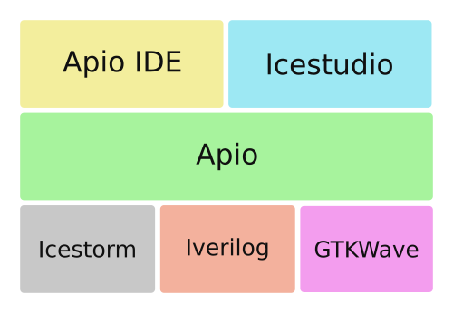
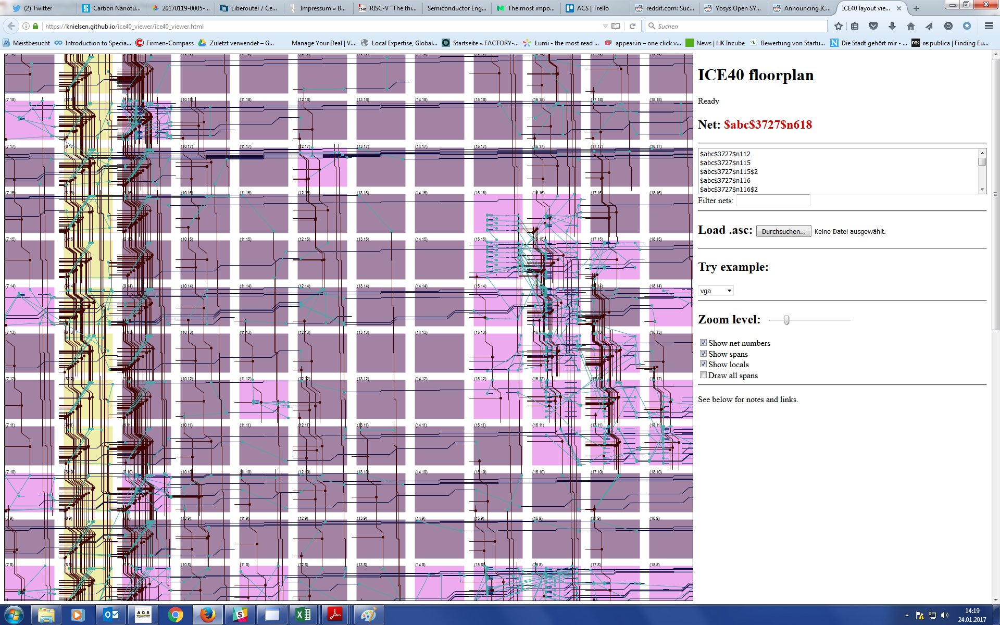

# FPGAs: Las impresoras 3D de la electrónica ([172319GE043](https://www.juntadeandalucia.es/educacion/secretariavirtual/consultaCEP/actividad/172319GE043/))

## CEP Linares-Andújar

### José Antonio Vacas @javacasm

### 30/1/2017

## Uso

### Herramientas

Podemos elegir entre usar Verilog o un diseño visual, entre usar heramientas de bajo nivel o trabajar a un nivel más alto.

#### [Apio](http://apiodoc.readthedocs.io/en/stable/source/installation.html)

Paquete python que utiliza las herramientas Icestorm

    sudo pip install -U apio

(si no tenemos instalado pip ... sudo apt install python-pip)
(instalación global, se puede hacer también local con virtualenv)

Apio incluye sus propios drivers del chip FTDI, necesarios para su buen funcionamiento.
Para activarlos

    sudo apio drivers --enable

Ahora instalamos la toolchain necesaria

    apio install -all

Ya lo tenemos listo para hacer cualquier operación

Creamos un nuevo proyecto:

    apio examples -d leds
    cd leds

Ahora creamos la configuración para nuestra placa

    apio init --board icezum

Comprobamos que el proyecto está ok

    apio verify

Si tenemos instalado algún simulador (GTKWave)

    apio sim

Cuando estemos conformes con el resultado, sintetizamos el bitstream

    apio build

Y lo enviamos a la placa con

    apio upload

Para ver el routeado: ICEfloorplan

#### [Apio IDE](https://github.com/FPGAwars/apio-ide/wiki)

Se trata de un paquete de Atom que permite integrar Apio en PlatformIDE

Una vez instalado Apio, instalamos Atom

Después instalamos el paquete Apio-ide que configuramos para que encuentre a Apio

#### [ICEStudio](https://github.com/FPGAwars/icestudio)

Descargarmos la [última release](https://github.com/FPGAwars/icestudio/releases)

##### [Ejemplos](https://github.com/Obijuan/myslides/tree/master/2016-11-18-Maker-faire-Bilbao-FPGAs-libres/demos)

### Ejemplos

* [Ejemplos de iceZum](https://github.com/FPGAwars/icezum/tree/master/examples)

* [Procesador simplez](https://github.com/Obijuan/simplez-fpga)

* [Procesador ACC (procesador de las naves Apolo, sí las de la Luna)](https://github.com/Obijuan/ACC)

* [Periféricos](https://github.com/FPGAwars/FPGA-peripherals)

* [Ejemplos de IceZum Studio](https://github.com/FPGAwars/icestudio-examples)

* [Control de servo](https://github.com/Obijuan/digital-electronics-with-open-FPGAs-tutorial/tree/master/blocks/ServoBit-180)

* [Siguelíneas](https://groups.google.com/forum/#!topic/fpga-wars-explorando-el-lado-libre/nL4UO4Km2SM)

* [PWM](https://groups.google.com/forum/#!topic/fpga-wars-explorando-el-lado-libre/ClU5gaviQWw)

* [Control de encoder](https://groups.google.com/forum/#!topic/fpga-wars-explorando-el-lado-libre/nu64aty75MI) [video](https://www.youtube.com/watch?v=o5FU0IMdsDs)

* [Dí hola](https://groups.google.com/forum/#!topic/fpga-wars-explorando-el-lado-libre/WGdscErV6xA)

* Cómo migrar un ejemplo entre placas

* Creando bloques
