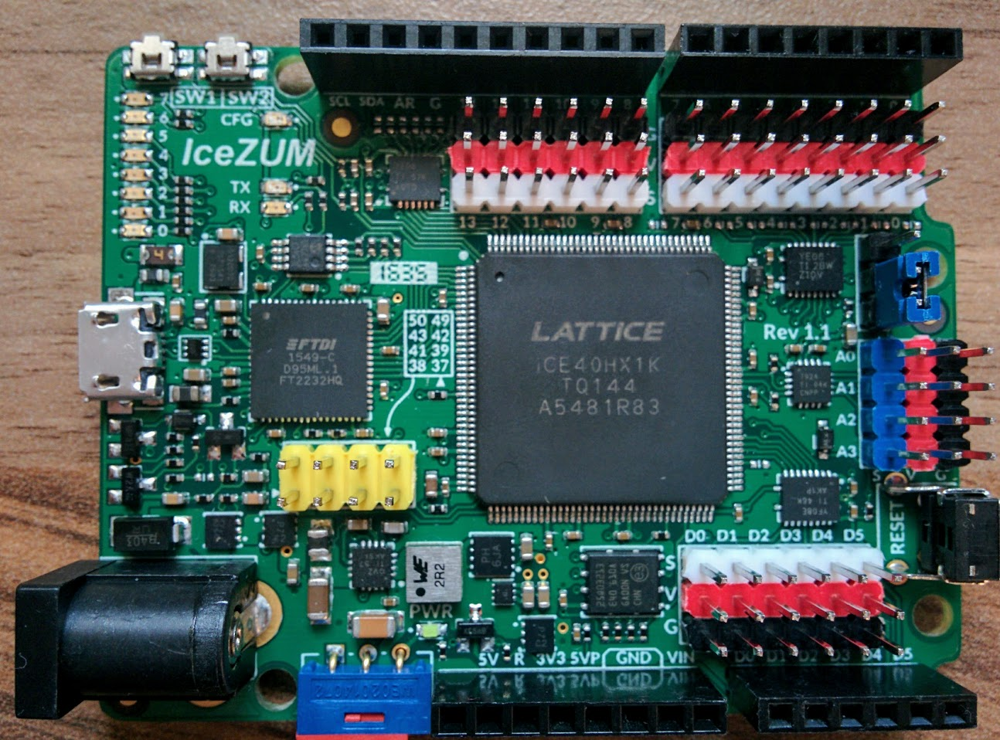
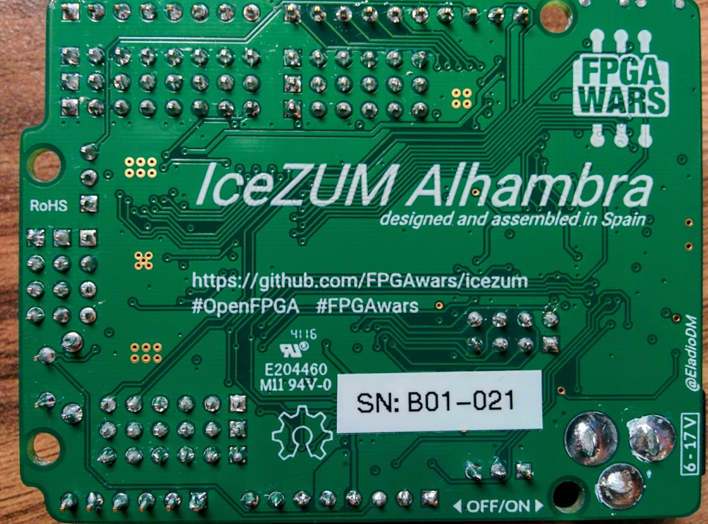
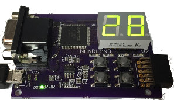
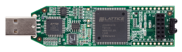
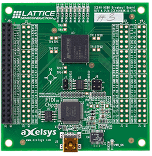
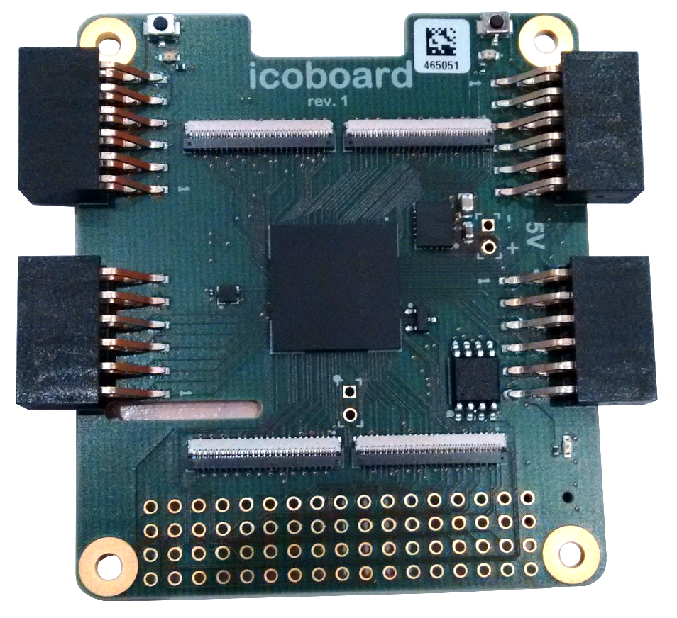

# FPGAs: Las impresoras 3D de la electrónica ([172319GE043](https://www.juntadeandalucia.es/educacion/secretariavirtual/consultaCEP/actividad/172319GE043/))

## CEP Linares-Andújar

### José Antonio Vacas @javacasm

### 30/1/2017

## IceZum Alhambra

Es una placa totalmente [libre (Open Hardware)](https://github.com/FPGAwars/icezum) que incluye una FPGA en un formato totalmente compatible  con Arduino

## Orígenes

* Juan Gonzalez (Obijuan)
* Eladio Delgado: diseñador y constructor de la placa
* Jesús Arroyo: desarrollador del software

* En sus inicios fue un proyecto financiado por bq

([Historia](https://github.com/FPGAwars/icezum#history))

## Descripción de la ICEZum Alhambra

* FPGA development board (iCE40HX1K-TQ144 from lattice)
* Open hardware
* Compatible with the opensource icestorm toolchain
* Arduino like board: similar pinout than Arduino one / BQ zum.
* You can Reuse most of available shields
* Control your robots / printbots from an FPGA
* 12 MHZ MEMS oscillator
* ON/OFF switch (turn off your mobile robot easily)
* Input power voltage: 6 - 17v
* Max input current: 3A (Perfect for powering your robots)
* 20 Input/output 5v pins
* 8 Input/Output 3.3V pins
* USB micro-B connector for programming the FPGA from the PC (same than zum board)
* FTDI 2232H USB device allows FPGA programming and UART interface to a PC
* Reset pushbutton
* 8 general purpose leds (user leds)
* 2 general purpose pushbuttons
* 4 analogue inputs though I2C bus

## Descripción de la placa

  [Pinout](https://github.com/FPGAwars/icezum/wiki#pinout)

  

### ¿Cómo funciona?

Las FPGAs pierden su configuración (bitstream) cada vez que se apagan.

Cuando escribimos el bitstream, este se almacena en una memoria ¿RAM flash? y desde ahí cada vez que se resetea se envía a la FPGA

## Placas
[Icezum Alhambra](https://github.com/FPGAwars/icezum)

[Nandland Go board](https://www.nandland.com/goboard/introduction.html)

[iCEstick Evaluation Kit](http://www.pighixxx.com/test/portfolio-items/icestick/)

[iCE40-HX8K Breakout Board](http://www.latticesemi.com/en/Products/DevelopmentBoardsAndKits/iCE40HX8KBreakoutBoard.aspx)

[icoBOARD 1.0](http://icoboard.org/about-icoboard.html)

[CAT Board](https://hackaday.io/project/7982-cat-board)

[Kéfir I](http://fpgalibre.sourceforge.net/Kefir/)

## Recursos

* [Wiki de la IceZum Alhambra](https://github.com/FPGAwars/icezum/wiki)

## Limitaciones

¿Hay un número máximo de reescrituras?: [La limitación está en el número máximo de reescrituras de la memoria que se usa](http://digital.ni.com/public.nsf/allkb/91DE0C3B7740C287862574D300646369)

## Dudas

¿configuración de accesso rápido por  teclado de iceStudio?

¿Configuración Pull up?

¿Cómo se crean losbloques?
